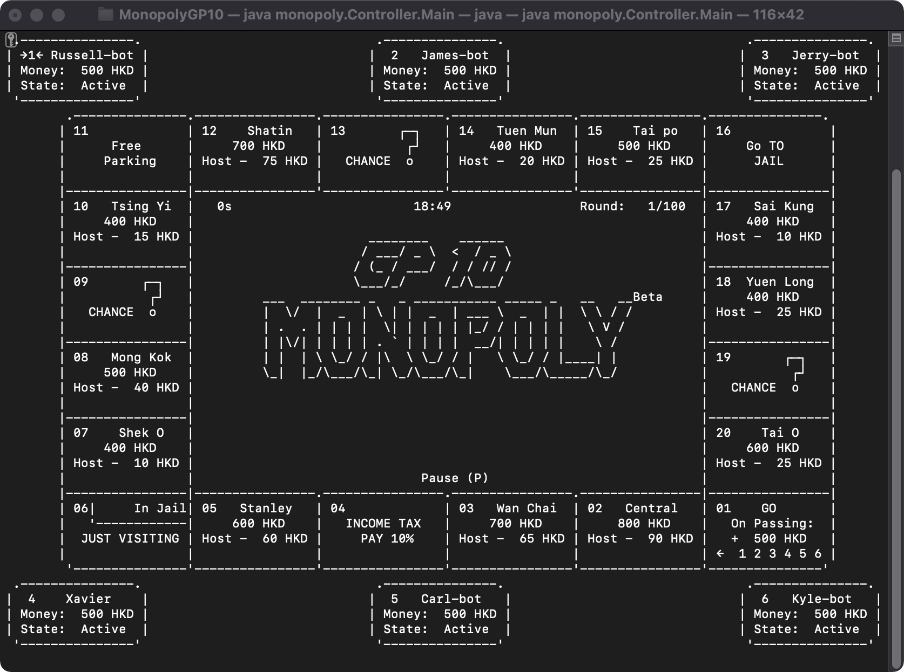

# GP-10 Monopoly
## Introduction
The implementation of a group project in course COMP3211 Software Engineering (21/22 sem 1) of The Hong Kong Polytechnic 
University from group 10.

This is a Command-Line based simple Monopoly game running on OS X or Linux terminal. The game uses a custom GUI-like 
interface and supports keyboard input without echo. The game interface is refreshed, with a refresh rate currently set 
at 10. MVC architecture is applied throughout the game.

### Refreshed Interface
Although the command line interface is used as the display, we strive for a GUI-like operation experience, so we 
implement a large number of API, such as Window, Widget, Button, Label, and so on. The whole interface
is refreshed in real time every 0.1s. ANSI escapes are used to move the Terminal cursor so that the terminal window 
position remains fixed when the interface is refreshed. That's why the game does not work on Windows.
### Key Listen without Echo
In Terminal of the Unix family of operating systems, keyboard input usually results in an echo i.e. The keyboard input
would be displayed directly in Terminal, but it was clear that the echo would mess with our display, and our game 
did not need this feature, so we blocked it.
### Animations
Because the rules and mechanics of the game are relatively simple, the game runs as fast as rock-paper-scissors. We 
considered adding some animations to slow down the pace of the game and make it more playable. Detailed animations are 
shown in the video below.

## Demo Video

## User Manual
- **User operation:** After each operation is done, you should press “ENTER” to let the operation work. All the operations below are based on this. 
Menu Page: User should press “W” and “S” to change his/her choice.
- **Setting Page:** User can press “W”, “A”, “S”, or “D” and then “ENTER” to decide the game’s player number, robot number and robot level. To be specific, “W” means up, “S” means down, “A” means left and “D” means down. Once decided, user can press “ENTER” to move to the next stage.
- **Game Page:** After the game begins, user should press “ENTER” to roll the dice.
When facing different events, user should press “A” or “D” to change the choice and “ENTER” to make the decision.
During the game, user can press “P” then “ENTER” to pause the game.
- **Pause Page:** User should press “W” or “S” to change his/her choice.
- **End Page:** User should press “W” or “S” to change his/her choice.

- **Details in the user [manual document](User Manual.pdf)**.

## Developer Manual
### Test Environment
- Java JDK: Java 16 (source 15)
- OS: OS X 11 and 12 on ARM64
- IDE: IntelliJ Idea 2021
- Terminal: zsh

### System Requirements
- Java JDK Version: 16 (source 15) (14 will fail due to not supporting string box)
- Operating System: OS X 11(Big Sur), 12(Monterey) on both X86-64, ARM64 
- In theory other Unix Family OS works, but never tested.

### How to Run?
1. Open terminal and switch the working direction to folder `/MonopolyGP10`
2. Enter `java -cp out/production/monopolyGP10 monopoly.Controller.Main`
3. Please resize the terminal window to suitable before play.
4. Please do not use Idea Console to run this game, the KeyboardListener will fail!
5. Use either terminal or Idea inner terminal. `zsh` is highly recommended.
6. Please set the working Dir of the terminal to folder `/MonopolyGP10`, or the saver and loader won’t work.

### How to Compile?
1. Open the Project Folder “MonopolyGP10” through Idea.
2. Click button “Build” (The Hammer on the left of Debugging Configuration)
3. Do steps in “[How to Run?](#how-to-run)”
4. The compiled .class files are built on ARM64 machine, if your Mac is X86 arch, please build it 
by yourself before running.
5. Some parameters are changeable under the file [monopoly.Model.Configs](src/monopoly/Model/Configs.java). 
You can adjust them by following the comments. But we do not guarantee the game runs without any trouble after changing the values.

### -END-
